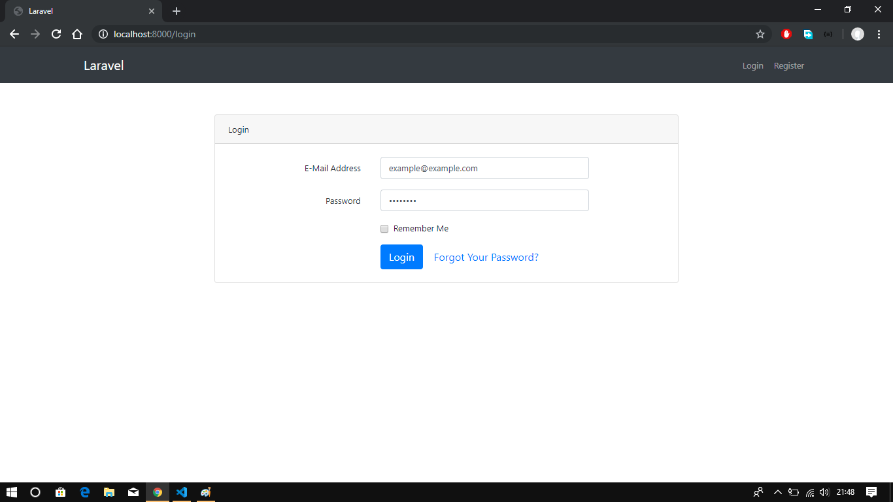
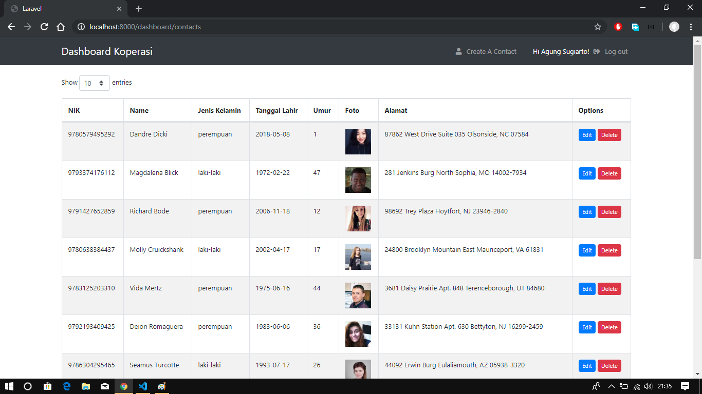
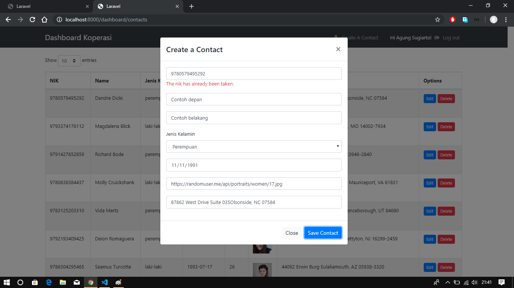
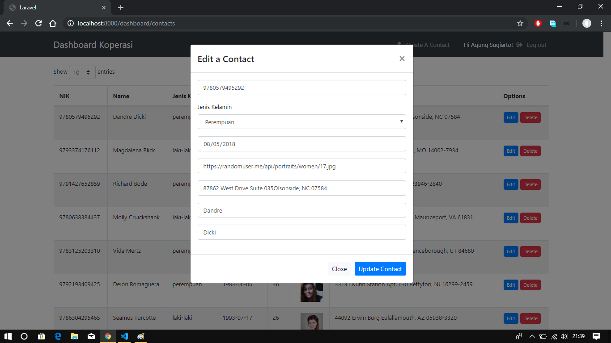

# Laravel Ajax CRUD

Program sederhana Ajax Crud dengan Laravel 5.8. 

# Installation
### Clone the repository:
```
git clone https://github.com/agungsugiarto/laravel-ajax-crud.git
```

### Pindah ke directory laravel-ajax-crud:
```
cd laravel-ajax-crud
```

### Install dependency:
```
composer install
```

### Buat database baru. Kemudian rename .env.example ke .env selanjutnya sesuaikan dengan konfigurasi database anda:
```
DB_CONNECTION=mysql
DB_HOST=127.0.0.1
DB_PORT=3306
DB_DATABASE=homestead
DB_USERNAME=homestead
DB_PASSWORD=secret
```

### Migrasi database:
```
php artisan migrate
```

### Buat data dummy dengan perintah:
```
php artisan db:seed --class=ContactsTableSeeder
```

### Buat kunci aplikasi:
```
php artisan key:generate
``` 
### Jalankan aplikasi dengan perintah:
```
php artisan serve
``` 

Sekarang buka browser dengan alamat address http://localhost:8000/

### Default untuk login.
```
email       : agungsugiarto@gmail.com
password    : password
```
# Screenshoot
|   |   |
| ------------- | ------------- |
| Login  |  Index |
| | |
| Create  |  Edit |
| |  |
